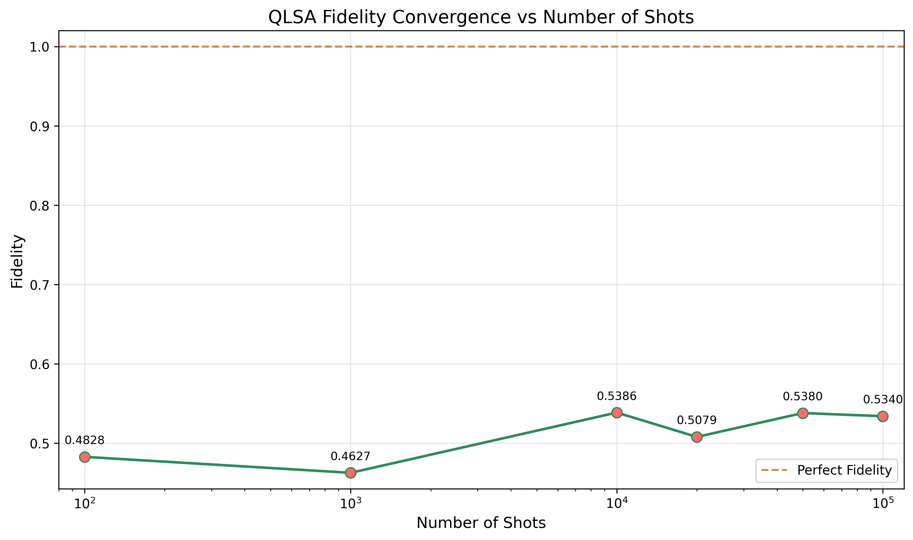
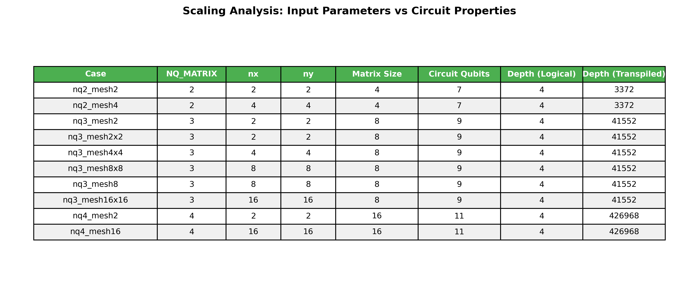
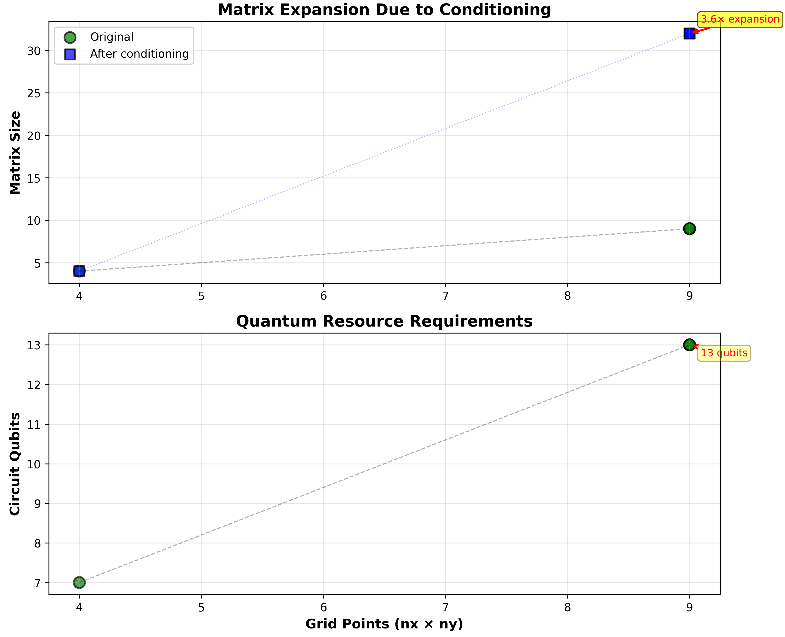

Variations on the ORNL CFD "Winter Challenge"
=====

***************************************************************************************
Table of Contents
=====

+ Overview
    - Key Learnings
    - Source Code Origin
    - Statevectors vs. Measurement-based
    - Costs of Real Quantum Computers
    - Experimental Variations

+ ORNL Case Variations
    - Clean Sim vs. NISQ
    - Real Backend
    - All Simulated Backends
    - Qubit Scaling
    - Physical Size Scaling
    - Uncertainty Quantification

+ Final Thoughts

***************************************************************************************
Key Learnings
=====

- The HHL algorithm on real quantum computers in the NISQ era is so noisy as to be unusable, problems so small as to have no practical utility. However, on clean simulators it can show useful fidelity, and suggests that in future post-NISQ era quantum may yet have utility for CFD.

- HHL devolves into an Ax=b problem, which can be viewed independently of CFD and benchmarked against existing matrix solvers. Mathematical interest in quantum computing may precede engineering utility. 

- An increase in qubits does not always translate to an increase in fidelity. Qubit count is not the only measure of quantum computer performance. 

- Increases in shot counts often improve fidelity and reproducibility (decrease in uncertainty), but to a limit.

- The cost of running cases beyond a few toy examples on real quantum computers is prohibitively high.

- The rapid changes in quantum hardware and software make software maintence and repeatability a challenge. Breaking changes in foundational libraries like Qiskit are not uncommon. One cannot be continuously porting code to keep up with these changes - sandboxes to wall off code with short shelf life are needed, with interoperability between. Simple code runs are actually more complex heterogeneous workflows.

***************************************************************************************
Source Code Origin
=====

HHL
: a quantum algorithm that solves systems of linear equations, Ax=b. It is notable for potentially offering an exponential speedup over classical algorithms under certain conditions.

HHL takes your classical vector b, normalizes it, and encodes it as a quantum state |b⟩. This becomes the initial state. The A matrix is encoded for Hamiltonian simulation by the circuit which executes QPE (Quantum Phase Estimation) to extract eigenvalues, followed by a controlled rotation (reciprocal calculation), and finally an Inverse QPE to disentangle the solution state which is classically processed to yield the solution vector x.

ORNL provided code used in their Frontier training (https://github.com/olcf/hands-on-with-frontier). The pertinent HHL portion originated with the Winter Challenge 2025 (https://github.com/olcf/wciscc2025), and notably the key `linear_solvers` library used in the current code comes from (https://github.com/jw676/quantum_linear_solvers) which is a fork of our work (https://github.com/agallojr/quantum_linear_solvers) which we of course circularly forked from them and updated it to work with Qiskit 2.0+, from its 0.x origins. We then further forked hands-on-with-frontier - the subfolder which contains the QLSA code.

In order to orchestrate workflows and keep artifacts separated, we use some workflow tooling we developed (https://github.com/lwfm-proj/lwfm) which is inspired by our industrial experience (https://link.springer.com/chapter/10.1007/978-3-031-23606-8_16).

The ORNL code contains references to IonQ and IQM drivers. In the case of IQM, these are pinned to older version of Qiskit. We have a strong preference (quantum is moving fast!) to stay on the tip of the major lib version trees like Qiskit, thus in our fork of the ORNL code we removed these dependencies. 

***************************************************************************************
Statevectors vs. Measurement-based
====

statevector
: "a column vector within a complex vector space that completely describes the state of a quantum system. For a system of n qubits, the state vector is a 2^n-dimensional complex vector whose components represent the probability amplitudes for the system to be in each possible configuration."

expectation value
: "the weighted average of a random variable's possible outcomes, where each outcome is weighted by its probability. It represents the long-run average value of the variable and is calculated by summing the product of each value and its probability. This value does not have to be a possible outcome itself but provides a central tendency of the distribution over many trials." 

The sample code (test_linear_solver.py) uses statevector-based HHL - barring perhaps changes from a random seed, it is going to produce the same result every time. HHL.solve() also uses a statevector with observables and computes an expectation value. (see linear_solvers/hhl.py)

You also cannot (with Qiskit) introduce noise into a statevector-based simulation.

We modified the ORNL code to use measurement-based HHL - to make it accept shot counts, which we expect to impact the fidelity of the results. To do this, we inject qubit measurements into the circuit which is produced by the ORNL code. 

Because we produce the circuit in one runtime sandbox (aka site), pinned to its own dependencies, and run it on another (again with its own dependencies), we use QPY serialization format to pass the circuit between them. This might not be useful (t.b.d.) if we wanted to move outside of Qiskit. 

We (have come to) understand that the measurement part of the circuit must be added with the libraries of the runtime site, set to the specific quantum backend, and we transpile for that backend in that runtime sandbox site.

***************************************************************************************
Costs of Real Quantum Computers
=====

Limited free tier access to older quantum computers is available from vendors like IBM. These are useful for beginners running small toy problems for learning basic concepts, but quickly becomes exhausted running loads even those of limited size discussed in this document.

Simulators, while able to mimic the specific noise and performance characteristics of quantum hardware, only scale to a point, even on HPC.

The cost of running on real hardware is prohibitively high unless there is a strong value proposition. AWS Braket, for example, is pennies per shot, but the cases in this document run on the order of 100,000 shots per (ORNL asked for 1M shots). An hour reserved price is thousands of dollars. IBM's pricing is similar.

https://aws.amazon.com/braket/pricing/

https://www.ibm.com/quantum/products#access-plans

***************************************************************************************
Original ORNL Cases
=====

The following are specified by the ORNL challenge doc:

- 2x2 mesh (nx=ny=2), vary the shots, show fidelity
- increase 2x2 mesh up to nx=ny=32, vary the shots, show fidelity & UQ
- 2x2 mesh on varied backends, vary the shots, show fidelity & UQ
- show quasi-probability of the results from the backend case above
- solve the Hele-Shaw problem for nx=ny=3, for pressure & velocity

We will do some but not all of these things, and add a few of our own.

***************************************************************************************
Variations
=====

Using the ORNL challenge doc as a guide although at times not literally, the following parameters will be varied:

- shot count: [100, 1000, 10 000, 100 000, (1 000 000)]
A million shots can take a while to run without necessarily improving the fidelity of the results, thus having shown that to ourselves, the results we show in this document usually use fewer shots.

- backend: ["density_matrix_sim__aer",          # no noise
            "matrix_product_state_sim_aer",     # no noise
            "ibm_brisbane_aer",                 # simulation of IBM_Brisbane, w. its noise model
            "ibm_torino_aer",                   # simulation of IBM_Torino, w. its noise model
            "ibm_brisbane",                     # real IBM_Brisbane
    ]
These strings are provided by the lwfm workflow tool's IBM site driver. The driver provides an abstraction over running on different backends, local simulators, and real cloud based machines, using the latest Qiskit libs and Aer simulator.

The following parameters are used to generate the matrix:
- nx: [2, 3, ...]             # number of grid points in x-direction
- ny: [2, 3, ...]             # number of grid points in y-direction
- nq: [2, 3, ...]             # number of qubits for the matrix

There are other CFD-oriented parameters in the ORNL code which we let remain fixed except where noted. The include the input and output pressures/velocity, the length and depth of the domain, the dynamic viscosity and fluid density.

***************************************************************************************
Clean Sim vs. NISQ
=====

We run five cases on a clean (no noise) density matrix simulator. For each we increment the size of the mesh (nx, ny) and the number of shots. We also run the same five cases on a simulator of IBM Brisbane with its noise profile (the "-b" cases. The results are compared to the classical fidelity.

The series cluster at the top is the clean (no noise) density matrix simulator. As we increase the shot count for a given grid resolution, fidelity improves to a limit. As we increase the grid resolution for the same size space, fidelity diminishes at first then improves then again plateaus at about the same limit as smaller grids.

The series cluster at the bottom is on a simulator of IBM Brisbane with its noise profile and shows significantly diminished fidelity in the NISQ era - increasing neither grid resolution nor shot count improves fidelity.

<figure style="border: 1px solid #0F0">
  
  <figcaption style="font-style: italic; padding: 2px; text-align: center">
    Fig1: Comparison of noiseless vs noisy simulators, for 2x2 mesh, 2 qubits (expands to 7 qubits, see chart below), varying shots. 
  </figcaption>
</figure>

***************************************************************************************
Real Backend
=====

Fixing the case at 2x2 and 2 qubits, we dial up the shot count from 100 to 100,000 on a real quantum computer - IBM Brisbane in the cloud. The 100,000 shot run takes 2m30s, which at IBM on demand pricing is about $250. In our case, we ran under a free 10m per month plan, but as you can see, one case varying shot count ate about 40% (~$400) of that time. Some corporate solution for funding runs on real quantum machines is needed.

In any event, the results were not great, and very similar to the same results obtained from a simulation of Brisbane's noise model. It seems that for small cases and educational purposes, the simulator is just as good, and free.

<figure style="border: 1px solid #0F0">
  
  <figcaption style="font-style: italic; padding: 2px; text-align: center">
  Fig2: 2x2 case, 2 qubits, 100 - 100,000 shots on a real quantum computer, IBM Brisbane. With on demand pricing, this would cost about $400. Results are poor, same as running on a simulator of Brisbane's noise model.
  </figcaption>
</figure>

***************************************************************************************
All Simulated Backends
=====

We run the same 32x32 mesh case on all simulated backends, dialing up the shots for each. We get results similar to the above.

<figure style="border: 1px solid #0F0">
  
  <figcaption style="font-style: italic; padding: 2px; text-align: center">
    Fig3: Comparison of noiseless vs noisy simulators, for 32x32 mesh, varying shots. This shows the gap between NISQ era and end-state error-corrected quantum computers. However, we note that the algorithm, even noiseless, does not provide perfect fidelity.
  </figcaption>
</figure>

***************************************************************************************
Qubit Scaling
=====

For the same 2x2 mesh, we increase the number of qubits N = [2, 3, 4] used for the matrix and for each qubit count we dial up the number of shots [100, 1000, 10000]. We limit the number of qubits to 4 and 10,000 shots because at those levels we're already in the range of 5 minutes per sub-case on a laptop. The size of the A matrix will initially be 2^N, but because the A matrix must be made to be Hermitian, and because of ancillas, the matrix size and number of actual qubits used is likely to be higher than the number specified.

- nq_matrix = 2 --> 7  qubits
- nq_matrix = 3 --> 9  qubits
- nq_matrix = 4 --> 11 qubits

Notice how an increase in qubits, while improving the precision of the eigenvalues in the QPE phase of the HHL algorithm, does not automatically improve fidelity.

<figure style="border: 1px solid #0F0">
  
  <figcaption style="font-style: italic; padding: 2px; text-align: center">
    Fig4: 2x2 case, num qubits N = [2, 3, 4], varying shots to 10,000. The size of the A matrix will be at least 2^N, but because the A matrix must be made to be Hermitian, and because of ancillas, the matrix size and number of qubits used is likely to be higher than the number specified. More qubits does not necessarily translate to more fidelity.
  </figcaption>
</figure>

Here we fix the qubit count at 3 and drive the shot count to 1M. While increased shot counts gets us over an initial hump, there is a limit to the improvement in fidelity due to shots.

<figure style="border: 1px solid #0F0">
  
  <figcaption style="font-style: italic; padding: 2px; text-align: center">
    Fig5: More shots does not translate to more fidelity - results plateau.
  </figcaption>
</figure>

Here we show the impact of increasing NQ_MATRIX, nx, and ny on the overall size of the A matrix, and the number of qubits used. Here circuit depth is expressed in pre-transpilation logical gates and  physical - the algorithm is the same no matter the sizing but each step grows with problem size.

<figure style="border: 1px solid #0F0">
  
  <figcaption style="font-style: italic; padding: 2px; text-align: center">
    Fig6: A chart showing the growth in the size of the quantum circuit as a function of the parameters used to generate that sized A matrix. Matrix size is a function of the number of qubits allocated, not mesh size. Actual circuit qubits grows because the matrix may need conditioning, projection to become Hermitian, and ancillas. Depths in the thousands are prohibitive in the NISQ era as the errors compound.
  </figcaption>
</figure>

***************************************************************************************
Physical Size Scaling
=====

We vary the length and width of the physical domain L=D=[1, 2, 3] while fixing the number of qubits used for the matrix (nq_matrix=2) and the mesh size (2x2), while varying the number of shots.

<figure style="border: 1px solid #0F0">
  
  <figcaption style="font-style: italic; padding: 2px; text-align: center">
    Fig7: Varying the size of the Hele-Shaw box L=D=[1,2,3], while fixing the number of qubits used for the matrix (nq_matrix=2) and the mesh size (2x2), while varying the number of shots on an idealized simulator. Fidelity converges with shots.
  </figcaption>
</figure>

***************************************************************************************
Uncertainty Quantification
=====

We use the physical size scaling case which varies L and D, as above. We run multiple times and calculate the uncertainty in the results. We use a simulation of IBM Brisbane with its noise profile.

As shots increase, the results become more reproducible.

<figure style="border: 1px solid #0F0">
  
  <figcaption style="font-style: italic; padding: 2px; text-align: center">
    Fig9: Running the same case multiple times, we can calculate the uncertainty in the results. As shots increase, the results become more reproducible.
  </figcaption>
</figure>

***************************************************************************************
Matrix Conditioning
=====

The typical CFD problem produces a matrix which does not necessarily have a nice, HHL-friendly condition number. The HHL algorithm requires the matrix to be Hermitian and positive-definite, and the condition number to be small. To address this, the HHL algorithm uses a matrix expansion technique. This increases the number of required qubits.

<figure style="border: 1px solid #0F0">
  
  <figcaption style="font-style: italic; padding: 2px; text-align: center">
    Fig10: Matrix conditioning sensitivity analysis. The HHL algorithm requires the matrix to be Hermitian and positive-definite, and to address this uses a matrix expansion technique, increasing the number of required qubits.
  </figcaption>
</figure>

***************************************************************************************
Final Thoughts
=====

Going forward in tracking the progress of quantum computing relative to CFD utility, metrics of interest include: 

1) Logical qubit count. Physical qubit count matters, in that some number of physical qubits are needed to insure one logical qubit, but as shown here, the NISQ physical qubits are too noisy to be useful.

2) Equally important is circuit depth, as it incorporates the compounding of gate error. Loosely together qubits (width) and circuit depth can be called "quantum volume". Even small qubit counts can require deep circuits too deep to be useful.

3) Speed of connection to classical hardware – in the medium term, almost everything will be hybrid classical + quantum, as volume limitations will require it. For example variational algorithms can reduce quantum circuit depth requirements, at a cost of classically-driven iteration towards a solution.

4) A more distant consideration is the speed of the quantum portion itself.

For HHL, the combination of CFD case inputs results in the generation of an A matrix an b vector, which then results in a circuit to run over shots and measure. In a sense, the upstream CFD case is not as interesting at the matrix itself, which can be treated and benchmarked singularly, against classical methods and other quantum approaches. In other words, its more about the math than the CFD engineering.

While we are a long way away from utilizing an algorithm like HHL to solve an industrial CFD problem, a more interesting study specific to CFD going forward might involve thinking outside of simply "quantum-izing" classical methods, but to explore wholely new approaches to CFD inspired by quantum. 

***************************************************************************************
