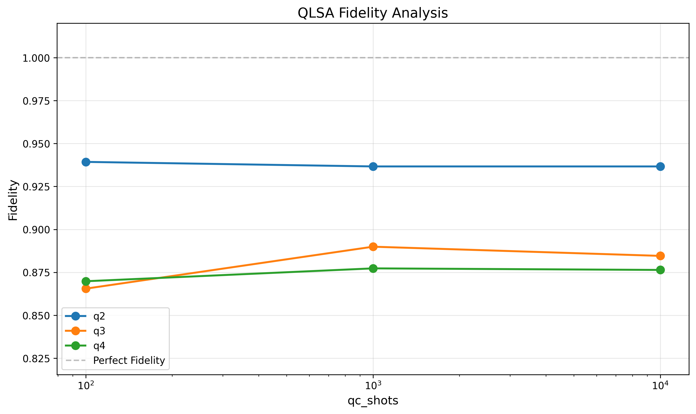

***************************************************************************************
Table of Contents
====

+ Overview
    - Source Code Origin
    - Statevectors vs. Measurement-based
    - Costs of Real Quantum Computers
    - Experimental Variations

+ ORNL Case Variations
    - Mesh by Shots, Clean vs. NISQ
    - 32x32 Mesh on all Simulated Backends
    - Qubit Scaling
    - Physical Size Scaling

***************************************************************************************
Source Code Origin
=====

ORNL provided code used in their Frontier training (https://github.com/olcf/hands-on-with-frontier). The pertinent HHL portion originated with the Winter Challenge 2025 (https://github.com/olcf/wciscc2025), and notably the key `linear_solvers` library used in the current code comes from (https://github.com/jw676/quantum_linear_solvers) which is a fork of our work (https://github.com/agallojr/quantum_linear_solvers) which we of course circularly forked from them and updated it to work with Qiskit 2.0+, from its 0.x origins. We then further forked hands-on-with-frontier - the subfolder which contains the QLSA code.

In order to orchestrate workflows and keep artifacts separated, we use some workflow tooling we developed (https://github.com/lwfm-proj/lwfm) which is inspired by our industrial experience (https://link.springer.com/chapter/10.1007/978-3-031-23606-8_16).

The ORNL code contains references to IonQ and IQM drivers. In the case of IQM, these are pinned to older version of Qiskit. We have a strong preference (quantum is moving fast!) to stay on the tip of the major lib version trees like Qiskit, thus in our fork of the ORNL code we removed these dependencies. 

***************************************************************************************
Statevectors vs. Measurement-based
====

statevector
: "a column vector within a complex vector space that completely describes the state of a quantum system. For a system of n qubits, the state vector is a 2^n-dimensional complex vector whose components represent the probability amplitudes for the system to be in each possible configuration."

expectation value
: "the weighted average of a random variable's possible outcomes, where each outcome is weighted by its probability. It represents the long-run average value of the variable and is calculated by summing the product of each value and its probability. This value does not have to be a possible outcome itself but provides a central tendency of the distribution over many trials." 

The sample code (test_linear_solver.py) uses statevector-based HHL - barring perhaps changes from a random seed, it is going to produce the same result every time. HHL.solve() also uses a statevector with observables and computes an expectation value. (see linear_solvers/hhl.py)

You also cannot (with Qiskit) introduce noise into a statevector-based simulation.

We modified the ORNL code to use measurement-based HHL - to make it accept shot counts, which we expect to impact the fidelity of the results. To do this, we inject qubit measurements into the circuit which is produced by the ORNL code. 

Because we produce the circuit in one runtime sandbox (aka site), pinned to its own dependencies, and run it on another (again with its own dependencies), we use QPY serialization format to pass the circuit between them. This might not be useful (t.b.d.) if we wanted to move outside of Qiskit. 

We (have come to) understand that the measurement part of the circuit must be added with the libraries of the runtime site, set to the specific quantum backend, and we transpile for that backend in that runtime sandbox site.

***************************************************************************************
Costs of Real Quantum Computers
=====

<put something here about cost of running on IBM, Braket, etc.>

***************************************************************************************
Original ORNL Cases
=====

The following are specified by the ORNL challenge doc:

- 2x2 mesh (nx=ny=2), vary the shots, show fidelity
- increase 2x2 mesh up to nx=ny=32, vary the shots, show fidelity & UQ
- 2x2 mesh on varied backends, vary the shots, show fidelity & UQ
- show quasi-probability of the results from the backend case above
- solve the Hele-Shaw problem for nx=ny=3, for pressure & velocity

We will do some but not all of these things, and add a few of our own.

***************************************************************************************
Variations
=====

Using the ORNL challenge doc as a guide although at times not literally, the following parameters will be varied:

- shot count: [100, 1000, 10 000, 100 000, (1 000 000)]
A million shots can take a while to run without necessarily improving the fidelity of the results, thus having shown that to ourselves, the results we show in this document usually use fewer shots.

- backend: ["density_matrix_sim__aer",          # no noise
            "matrix_product_state_sim_aer",     # no noise
            "ibm_brisbane_aer",                 # simulation of IBM_Brisbane, w. its noise model
            "ibm_torino_aer",                   # simulation of IBM_Torino, w. its noise model
            "ibm_brisbane",                     # real IBM_Brisbane
    ]
These strings are provided by the lwfm workflow tool's IBM site driver. The driver provides an abstraction over running on different backends, local simulators, and real cloud based machines, using the latest Qiskit libs and Aer simulator.

The following parameters are used to generate the matrix:
- nx: [2, 3, 4, 5, 6, 7, 8]             # number of grid points in x-direction
- ny: [2, 3, 4, 5, 6, 7, 8]             # number of grid points in y-direction
- nq: [2, 3, 4, 5, 6, 7, 8]             # number of qubits for the matrix

There are other CFD-oriented parameters in the ORNL code which we let remain fixed except where noted. The include the input and output pressures/velocity, the length and depth of the domain, the dynamic viscosity and fluid density.

***************************************************************************************
Mesh by Shots, Clean vs. NISQ
=====

We run five cases on a clean (no noise) density matrix simulator. For each we increment the size of the mesh (nx, ny) and the number of shots. We also run the same five cases on a simulator of IBM Brisbane with its noise profile (the "-b" cases. The results are compared to the classical fidelity.

The series cluster at the top is the clean (no noise) density matrix simulator. As we increase the shot count for a given grid resolution, fidelity improves to a limit. As we increase the grid resolution for the same size space, fidelity diminishes at first then improves then again plateaus at about the same limit as smaller grids.

The series cluster at the bottom is on a simulator of IBM Brisbane with its noise profile and shows significantly diminished fidelity in the NISQ era - increasing neither grid resolution nor shot count improves fidelity.

***************************************************************************************
32x32 Mesh on all Simulated Backends
=====

We run the same 32x32 mesh case on all simulated backends, dialing up the shots for each. We get results similar to the above.

***************************************************************************************
Qubit Scaling
=====

For the same 2x2 mesh, we increase the number of qubits N = [2, 3, 4] used for the matrix and for each qubit count we dial up the number of shots [100, 1000, 10000]. We limit the number of qubits to 4 and 10,000 shots because at those levels we're already in the range of 5 minutes per sub-case on a laptop. The size of the A matrix will initially be 2^N, but because the A matrix must be made to be Hermitian, and because of ancillas, the matrix size and number of actual qubits used is likely to be higher than the number specified.

- nq_matrix = 2 --> 7  qubits
- nq_matrix = 3 --> 9  qubits
- nq_matrix = 4 --> 11 qubits

Notice how an increase in qubits, while improving the precision of the eigenvalues in the QPE phase of the HHL algorithm, does not automatically improve fidelity.

Here we fix the qubit count at 3 and increase the shot count. While increased shot counts gets us over an initial hump, there is a limit to the improvement in fidelity due to shots.

***************************************************************************************
Physical Size Scaling
=====

We vary the length and width of the physical domain (L, D) while fixing the number of qubits used for the matrix (nq_matrix=3) and the mesh size (4x4), while varying the number of shots.

Next we vary the length and width of the physical domain (L, D) while fixing the number of qubits used for the matrix (nq_matrix=3) and increasing the mesh size (4x4, 8x8, 12x12), while varying the number of shots. Again, we see a limit to the improvement in fidelity due to shots.

***************************************************************************************
Uncertainty Quantification
=====

We use the physical size scaling case which varies L and D, as above, where the size of the mesh (nx=ny) increases proportionally. We run multiple times and calculate the uncertainty in the results. We use a simulation of IBM Brisbane with its noise profile.

***************************************************************************************
To Do
=====

 - relate num_qubits, nx, ny directly to A matrix size & number of qubits used

- quasi-probability
- Hele-Shaw
- any cases we want to re-run on HPC to probe the limits of simulators further

***************************************************************************************
