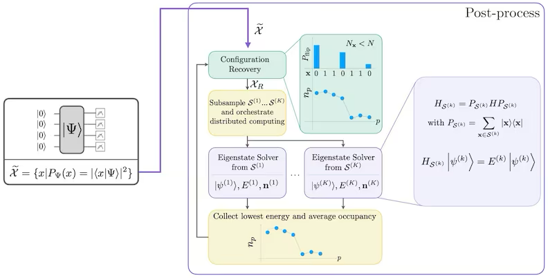
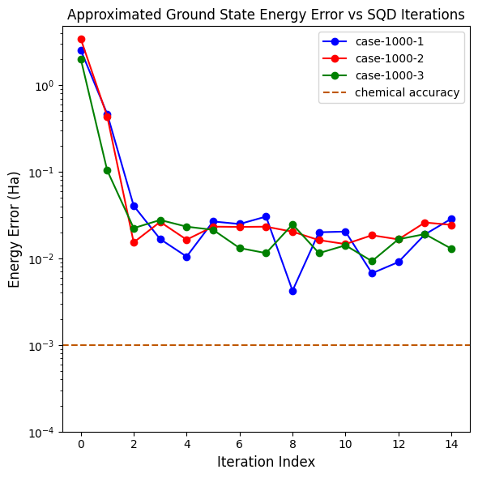

Summary
=====

Sample-based Quantum Diagonalization (SQD) is a method from IBM to perform quantum chemistry calculations on a quantum computer, beyond the scale of exact diagonalization. It does this with a hybrid quantum-classical approach. However, the size of the necessary quantum circuit to generate the samples used in the SQD iterations is beyond the capabilities of local simulators to test effectively on a molecule of even modest size (N2). An assessment of the method (versus for example Variational Quantum Eigensolver (VQE)) for computing molecular energies will need to be deferred to a future study with better hardware.

Introduction
=====

IBM has been shopping their Sample-based Quantum Diagonalization (SQD) method for about a year now, publishing peer reviewed, building on the work, releasing it as an add-on library for Qiskit. It is touted as a method to perform quantum chemistry calculations on a quantum computer, beyond the scale of exact diagonalization on a quantum computer. It does this with a hybrid quantum-classical approach.

The application is in computing molecular energies, the ground state energy being common. The published work "Chemistry Beyond the Scale of Exact Diagonalization on a Quantum-Centric Supercomputer" (https://arxiv.org/abs/2405.05068) studies small molecules (N2, [2Fe-2S] and [4Fe-4S]) in this noisy, error-prone quantum NISQ era, using up to 77 qubits on an IBM quantum computer.

The SQD algorithm is loosely:

1. Quantum Sampling: Prepare quantum states representing molecular wavefunctions and measure them to get electronic configurations (bitstrings)
2. Configuration Recovery: Use classical algorithms to recover missing important configurations from the quantum samples
3. Subspace Diagonalization: Project the molecular Hamiltonian onto the subspace spanned by these configurations and diagonalize classically
4. Iterative Refinement: Repeat the process to improve accuracy

Its a simple matter to import the SQD code into an existing Qiskit Python project. An example of use is here: https://quantum.cloud.ibm.com/docs/en/tutorials/sample-based-quantum-diagonalization

Baselining updated code
=====

Unfortunately this example uses an older version of the SQD library. In the fast moving quantum research space this staleness is common. We modified the example to use the latest version of the SQD library and Qiskit, then ran with the same molecule and SQD parameters. Both these cases use closed shell with synthetic, uniform bitstring counts to initialize the iterations. The initial comparison to IBM's example is below, and seems in a similar range:

IBM  |  Baseline case
:-------------------------:|:-------------------------:
  | 

Varying the SQD parameters
=====

The number of samples in each batch, and the number of batches are two parameters on the algorithm. On the left, using an open shell, we vary the size of a single batch from 100 to 5000 samples per, over the same number of iterations. Noting a sample size of 1000 produced at least one outlier better than expected chemical accuracy, we set samples=1000 and vary the number of batches per iteration from 1 to 3. Results were no better than a single batch with its one outlier. Again, synthetic counts are used to initialize the iterations.

Varying #samples,batch=1  |  Samples=1000, vary #batches
:-------------------------:|:-------------------------:
  | 

Using quantum circuit samples
=====

In an attempt to improve the results, the IBM team used a quantum circuit which is specifically modeled on the molecule in question is used to generate the bitstring samples used in the SQD iterations. But even the N2 molecule required 58 qubits to model with a quantum circuit influenced by the molecule's geometry and the geometry of the quantum computer. For running on a simulator, that is well beyond the capabilities, as least for small laptop-oriented computes and probably large ones too (~40 qubits is about the limit with MPI). As it is, even this simplified circuit required some transpilation optimization to get below 32 qubits, the limit of the local simulator.

For this open shell example we use a greatly simplified quantum circuit, with only a few rotations and no entanglement, to generate the bitstring samples used in the SQD iterations.

Varying #samples,batch=1  |  Samples=1000, vary #batches
:-------------------------:|:-------------------------:
  | 

Next steps
=====

1. Test on real quantum hardware with a circuit (e.g. based on local unitary cluster Jastrow ansatz) informed by the specific molecule and quantum hardware connection topology.
2. Test compared to standard VQE for solving the same problem.
3. Test with a modified VQE such as HiVQE from Qunova (IBM Qiskit function).

Code
=====

https://github.com/agallojr/qtsuite/tree/main/mat/qt01-mat-sqd

