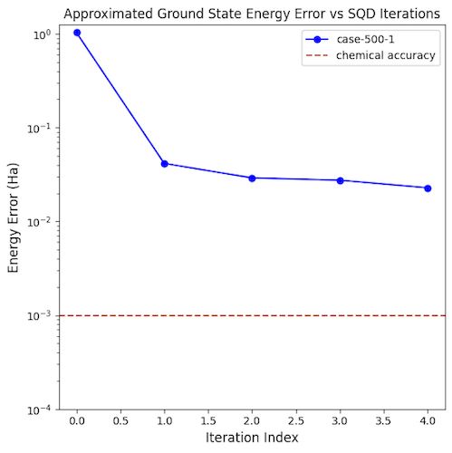
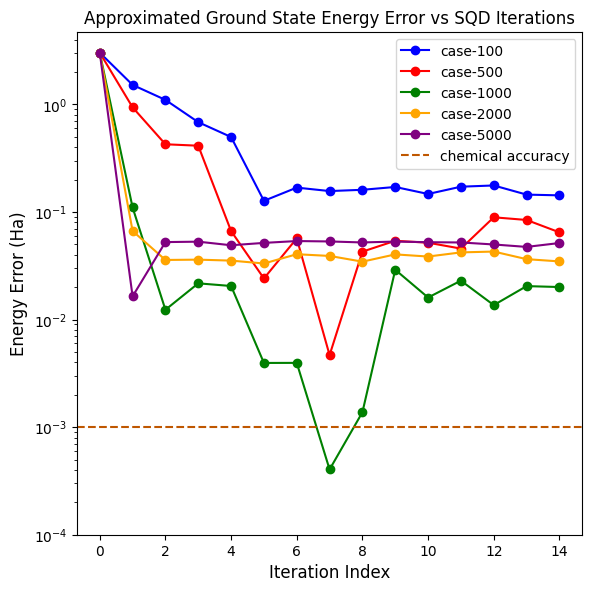

Introduction
=====

IBM has been shopping their Sample-based Quantum Diagonalization (SQD) method for about a year now, publishing peer reviewed, building on the work, releasing it as an add-on library for Qiskit. It is touted as a method to perform quantum chemistry calculations on a quantum computer, beyond the scale of exact diagonalization on a quantum computer. It does this with a hybrid quantum-classical approach.

The application is in computing molecular energies, the ground state energy being common. The published work "Chemistry Beyond the Scale of Exact Diagonalization on a Quantum-Centric Supercomputer" (https://arxiv.org/abs/2405.05068) studies small molecules (N2, [2Fe-2S] and [4Fe-4S]) in this noisy, error-prone quantum NISQ era, using up to 77 qubits on an IBM quantum computer.

<overview of algorithm>

Its a simple matter to import the SQD code into an existing Qiskit Python project. An example of use is here: https://quantum.cloud.ibm.com/docs/en/tutorials/sample-based-quantum-diagonalization

Baselining updated code
=====

Unfortunately this example uses an older version of the SQD library. In the fast moving quantum research space this staleness is common. We modified the example to use the latest version of the SQD library and Qiskit, then ran with the same molecule and SQD parameters. The initial comparison to IBM's example is here, and seems in a similar range:

IBM  |  Baseline case
:-------------------------:|:-------------------------:
  | 

Varying the SQD parameters
=====

The number of samples in each batch, and the number of batches are two parameters on the algorithm. On the left we vary the size of a single batch from 100 to 5000 samples per, over the same number of iterations. Noting a sample size of 1000 produced at least one outlier better than expected chemical accuracy, we set samples=1000 and vary the number of batches per iteration from 1 to 3. Results were no better than a single batch with its one outlier.

Varying #samples,batch=1  |  Samples=1000, vary #batches
:-------------------------:|:-------------------------:
  | 

Varying other stuff
=====

What fun!
